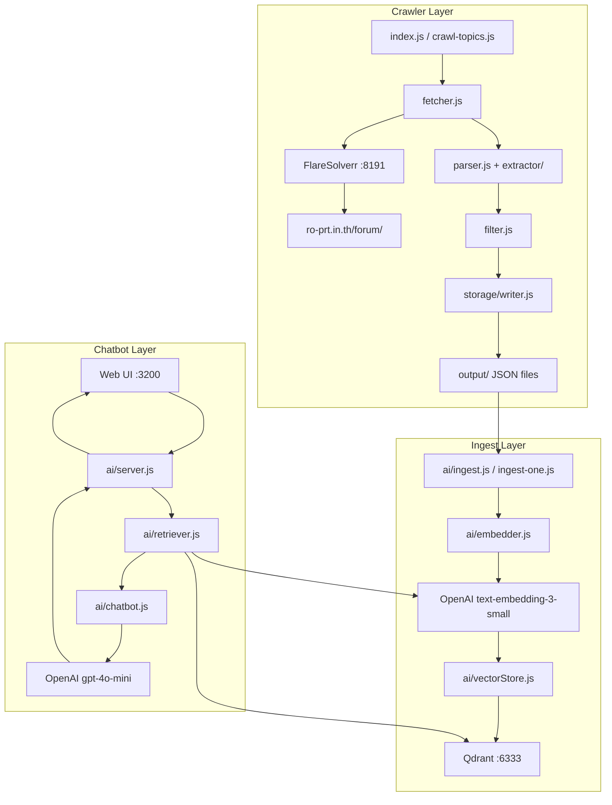
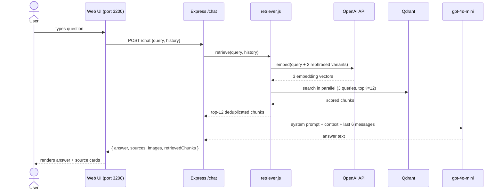
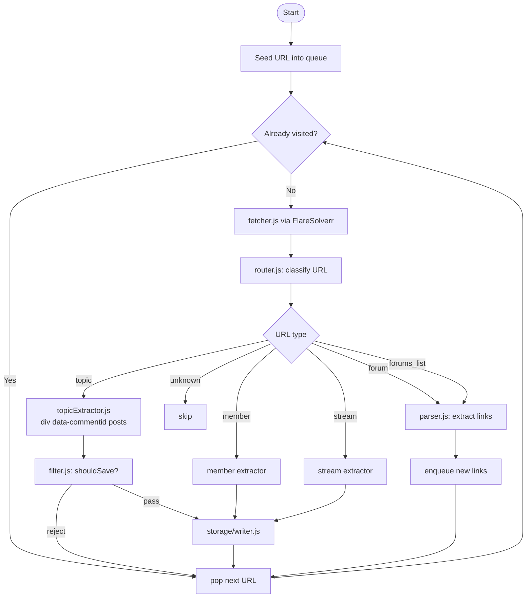
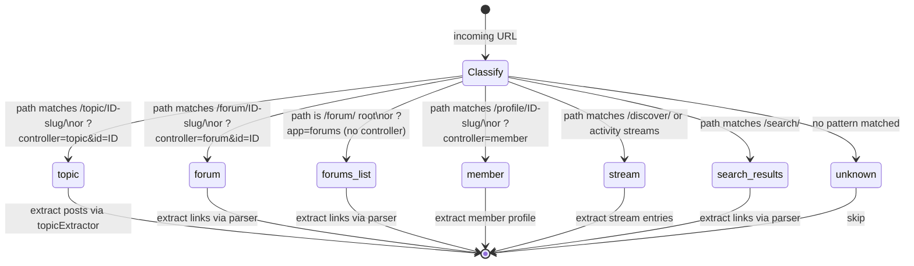

# crawler-webboard

A web crawler and RAG chatbot system for the Thai Ragnarok Online Classic community forum at [ro-prt.in.th/forum/](https://ro-prt.in.th/forum/).


---

## Overview

This system crawls the Thai RO Classic community forum, indexes its content into a vector database, and exposes a chatbot that answers player questions grounded in real forum posts.

The crawler uses FlareSolverr to bypass Cloudflare protection and performs a BFS traversal of the forum, extracting topics, posts, member profiles, and streams into structured JSON files. A separate ingest pipeline reads those files, splits the text into overlapping chunks, embeds them with OpenAI's `text-embedding-3-small` model, and upserts them into Qdrant for semantic retrieval.

The chatbot layer exposes an Express REST API and a static web UI. When a user submits a question, the retriever expands it into multiple phrasings, searches Qdrant in parallel, deduplicates results, and feeds the top-12 chunks into GPT-4o-mini alongside the recent conversation history — returning a grounded answer with source links and images from the original forum posts.

**RAG Quality Controls:**

- **Multi-query retrieval:** query is expanded into 3 phrasings (1 original + 2 GPT-generated), embedded in one batch, searched in parallel — results merged and deduplicated by text
- **Abbreviation expansion:** `expandAbbreviations()` in `retriever.js` runs a fast dictionary lookup before embedding to align query tokens with document tokens (e.g. `OGH` → `Old Glast Heim Memorial Dungeon`)
- **GPT abbreviation context:** system prompt includes a full RO abbreviation reference so GPT interprets user queries correctly (e.g. `NCT` = Nightmare Clock Tower Dungeon, not Nest of Faceworm)
- **Image relevance threshold:** images are only surfaced from chunks with similarity score ≥ 0.45; max 6 images returned; non-GIFs prioritized
- **Detail preservation:** for "how-to" questions GPT is instructed to include every step, item, NPC, and coordinate without summarizing

---

## System Architecture



---

## Data Flow



---

## Crawler Pipeline



---

## Project Structure

```
crawler-webboard/
├── index.js                  # BFS crawler entry point (npm start)
├── crawl-topics.js           # Targeted crawler for known topic IDs
├── ingest-one.js             # Single-topic ingest (URL or piped HTML)
├── config.js                 # Crawler configuration (concurrency, rate limit)
├── start.sh                  # One-command boot: FlareSolverr + Qdrant + chatbot
├── docker-compose.yml        # FlareSolverr (:8191) + Qdrant (:6333/:6334)
├── .env                      # Secrets and environment variables
│
├── crawler/
│   ├── router.js             # URL classifier (topic/forum/member/stream/...)
│   ├── queue.js              # Dedup BFS queue with URL normalization
│   ├── fetcher.js            # FlareSolverr HTTP client via native http module
│   ├── parser.js             # Cheerio HTML parser + link extractor
│   ├── filter.js             # shouldSave() — filters old events, non-Classic
│   └── extractor/
│       └── topicExtractor.js # Extracts posts via div[data-commentid]
│
├── storage/
│   └── writer.js             # Writes JSON to output/ with index tracking
│
├── output/                   # Crawler output (gitignored)
│   ├── topics/               # {id}-{slug}.json + index.json
│   ├── forums/               # {id}-{slug}.json + index.json
│   ├── members/              # {id}-{slug}.json + index.json
│   ├── posts/                # {topicId}/{postId}.json
│   └── streams/              # {YYYY-MM-DD}.json
│
└── ai/
    ├── config.js             # RAG configuration (topK, thresholds, models)
    ├── ingest.js             # Batch ingest pipeline (npm run ingest)
    ├── embedder.js           # prepareDocuments() + chunkText() with overlap
    ├── vectorStore.js        # Qdrant wrapper, stable hash-based IDs
    ├── retriever.js          # Multi-query expansion + parallel Qdrant search
    ├── chatbot.js            # GPT-4o-mini call, returns answer+sources+images
    ├── server.js             # Express API server (port 3200)
    └── public/               # Static web UI (chat client)
```

---

## Prerequisites

| Requirement | Version | Notes |
|---|---|---|
| Node.js | v22+ | CommonJS only — no ESM |
| Docker + Docker Compose | any recent | Runs FlareSolverr and Qdrant |
| OpenAI API key | — | Used for embeddings and chat |

---

## Installation

1. **Clone the repository**

   ```bash
   git clone <repo-url>
   cd crawler-webboard
   ```

2. **Install Node.js dependencies**

   ```bash
   npm install
   ```

3. **Create the `.env` file**

   ```bash
   cp .env.example .env
   ```

   Then fill in the values (see [Configuration](#configuration) below).

4. **Start Docker services**

   ```bash
   docker compose up -d
   ```

   This starts Qdrant on port 6333 and FlareSolverr on port 8191.

5. **Verify services are healthy**

   ```bash
   curl http://localhost:6333/health     # Qdrant
   curl http://localhost:8191/v1         # FlareSolverr
   ```

---

## Configuration

### `config.js` — Crawler

| Field | Default | Description |
|---|---|---|
| `concurrency` | `2` | Number of parallel fetch workers |
| `rateLimit` | `2000` | Milliseconds between requests |
| `requestTimeout` | `60000` | Per-request timeout in ms (must be ≥60s for FlareSolverr) |
| `retries` | `3` | Retry attempts on fetch failure |

### `ai/config.js` — RAG pipeline

| Field | Default | Description |
|---|---|---|
| `topK` | `12` | Number of chunks returned per search |
| `scoreThreshold` | `0.2` | Minimum cosine similarity to include a chunk |
| `embeddingModel` | `text-embedding-3-small` | OpenAI embedding model (1536 dims) |
| `chatModel` | `gpt-4o-mini` | OpenAI chat completion model |

### `.env` — Environment variables

| Variable | Required | Description |
|---|---|---|
| `BEARER_TOKEN` | Yes | OpenAI API key |
| `OPENAI_BASE_URL` | No | Override OpenAI base URL (e.g. for proxies) |
| `QDRANT_URL` | Yes | Qdrant endpoint, e.g. `http://localhost:6333` |
| `QDRANT_API_KEY` | No | Qdrant API key (required for cloud deployments) |
| `PORT` | No | Chatbot server port (default: `3200`) |

---

## Usage

### Full BFS Crawler

Starts from the forum root and crawls every reachable URL via BFS, respecting rate limits.

```bash
npm start
# equivalent: node index.js
```

Output is written to `output/` as JSON files. The crawler deduplicates URLs across restarts using the queue state.

---

### Targeted Topic Crawler

Crawls a specific list of known topic IDs without performing a full BFS traversal.

```bash
node crawl-topics.js
```

Edit the topic ID list inside `crawl-topics.js` before running.

---

### Single Topic Ingest

Ingest a single topic by URL or by piping raw HTML.

**By URL:**

```bash
node ingest-one.js "https://ro-prt.in.th/forum/topic/123-slug/"
```

**By piped HTML fragment:**

```bash
cat some-topic.html | node ingest-one.js
```

This embeds the topic's chunks and upserts them into Qdrant immediately — useful for testing or re-ingesting a specific topic without running the full batch.

---

### Batch Ingest

Reads all JSON files from `output/topics/`, chunks and embeds each one, then upserts into Qdrant.

```bash
npm run ingest
# equivalent: node ai/ingest.js
```

**Fresh ingest** (drops the existing Qdrant collection first):

```bash
node ai/ingest.js --fresh
```

---

### Chatbot Server

Starts the Express API server and serves the web UI.

```bash
npm run chat
# equivalent: node ai/server.js
```

Server listens on `http://localhost:3200` (or `PORT` from `.env`).

---

### One-Command Startup

Boots FlareSolverr, Qdrant, and the chatbot server together.

```bash
bash start.sh
```

Useful for production-like local setups where all three services need to be running.

---

## API Reference

| Method | Path | Request Body | Response |
|---|---|---|---|
| `POST` | `/chat` | `{ query: string, history: array }` | `{ answer, sources, images, retrievedChunks }` |
| `GET` | `/health` | — | `{ status: "ok" }` |
| `GET` | `/stats` | — | Qdrant collection stats |

**`POST /chat` example:**

```bash
curl -X POST http://localhost:3200/chat \
  -H "Content-Type: application/json" \
  -d '{"query": "วิธีเก็บเลเวลเร็วที่สุดคืออะไร", "history": []}'
```

**Response shape:**

```json
{
  "answer": "...",
  "sources": [{ "score": 0.87, "url": "https://...", "type": "post", "title": "..." }],
  "images": [{ "url": "https://...", "isGif": false, "alt": "", "score": 0.87, "topicId": "123", "sourceUrl": "https://..." }],
  "retrievedChunks": 12
}
```

> Note: the body field is `query`, not `message`.

---

## Web UI

The static chat client is served from `ai/public/` at `http://localhost:3200`.

- Sends `{ query, history }` to `POST /chat`; body field is `query` (not `message`)
- Conversation history is persisted in `localStorage` (key: `ro-chat-history`, max 40 messages) with images and sources saved per assistant message — images and source cards restore correctly on page reload
- All links (both inline answer text and source cards) open in a new browser tab (`target="_blank"`)
- Session identity is tracked via a UUID cookie `ro-chat-session` (30-day expiry)
- Lightbox for full-size image preview

---

## Troubleshooting

| Symptom | Cause | Fix |
|---|---|---|
| `TypeError: PQueue is not a constructor` | `p-queue` v6 uses ESM default export | Use `require('p-queue').default` |
| Fetch hangs or times out | FlareSolverr takes 12–20s per request | Set `requestTimeout` to at least `60000` ms |
| Axios import errors on Node.js v22 | Axios broken for native HTTP on Node.js v22 | Use Node.js native `http` module in `fetcher.js` |
| All posts map to the same entry | `_id` cast directly to string returns `""` | Use the ObjectId helper; never cast `primitive.ObjectID` directly |
| `ReferenceError: history is not defined` | Global variable named `history` conflicts with `window.history` | Rename to `chatHistory` in browser-side JS |
| Qdrant payload fields missing | Accessing `item.payload.metadata` instead of top-level payload | Use `get(item, 'payload', {})` — fields are at the top level |
| No posts extracted from topic pages | Using `article` as the post selector | Correct selector is `div[data-commentid]` |
| `/chat` returns 400 or empty response | Sending `message` field instead of `query` | Request body must use `query` field |
| Old Event Quest topics included | `filter.js` not applied | Ensure `shouldSave()` is called before writing |
| Images disappear after page reload | `images`/`sources` not stored in localStorage | Assistant messages now store extras; ensure you're on the latest `index.html` |
| GPT misnames dungeons (NCT = Nest of Faceworm) | GPT uses training knowledge over context | Fixed: RO abbreviation reference block injected into system prompt |
| Unrelated images appear with answers | Low-score chunks contribute images | Fixed: `IMAGE_SCORE_THRESHOLD = 0.45` in `chatbot.js` |

---

## URL Classification State Diagram

`crawler/router.js` classifies every URL into one of these states before it is processed.


